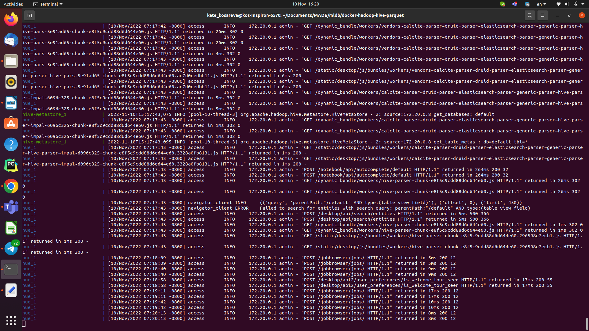

##Блок 1
1) Развернуть локальный Hive в любой конфигурации - 20 баллов

3) Подключиться к развернутому Hive с помощью любого инструмента: Hue, Python
Driver, Zeppelin, любая IDE итд (15 баллов за любой инструмент, максимум 30
баллов)
3) Сделать скриншоты поднятого Hive и подключений в выбранными вами
инструментах, добавить в репозиторий
